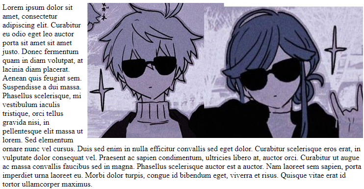

# Selectors

## `Element Selector`
The element selector allows developers to select HTML elements based on their element type.

+ Syntax :

*HTML*

    
Once upon a time...

    
In a hidden land...

*CSS*

    p { 
      color: blue; 
    }

---
## `ID Selector`
The ID selector uses the id attribute of an HTML element. Since the id is unique within a webpage, it allows the developer to select a specific element for styling. ID selectors are prefixed with a # character.

+ Syntax :

*HTML*

    New!

*CSS*

    #latest { 
      background-color: purple; 
    }

##  `Class selector`
The CSS rule has been applied to all elements with the specified class name. The class selector is prefixed with a . character.

+ Syntax :

*HTML*

    <a class="navigation">Go Back</a>
    
Go Forward

*CSS*

    .navigation { 
      margin: 2px;
    }

## `Element with class selector`
A more specific method for selecting HTML elements is by first selecting the HTML element, then selecting the CSS class or ID.

+ Syntax :

*HTML*

    

*CSS*

    p.introduction { 
      margin: 2px;
    }
---
## `Descendant Selector`
Selects all elements that are descendants of a specified element, Class or ID

+ Syntax :

*HTML* 

    

      <h1>Latest News</h1>
      

        <h1>Today's Weather</h1>
        
The weather will be sunny

      

      
Subscribe for more news

    

    

      <h1>Archives</h1>
    

*CSS*

    #blog h1 {
      color: blue;
    }

The CSS rule will select all h1 elements that are contained within the element with the ID blog

---
## `Child Selector`
Selects only direct children of an HTML tag and ignores any nested child tags inside it.

+ Syntax :

*HTML*

    

      <h1>Latest News</h1>
      

        <h1>Today's Weather</h1>
        
The weather will be sunny

      

      
Subscribe for more news

    

*CSS*

    #blog > h1 {
      color: blue;
    }

>**NOTE**:that this will not go beyond a single depth level. Therefore, the CSS rule will not be applied to the h1 element containing the text Today's Weather

---
## `:hover Pseudo-class`
Changes styles when a user hovers over or clicks on certain parts of your webpage, such as links

+ Simple Syntax :

*CSS*

    a:hover {
      color: orange;
    }
---
# Colour :

## `RGB value` 

+ Simple Syntax :

        p { 
          color: rgb(255, 0, 0); 
        }

---

## `RGBA value` 

+ Simple Syntax :

        p { 
          color: rgb(255, 0, 0,128); 
        }

---
## `HSL Value`

+ Simple Syntax :

        p { 
          color: hsl(0, 100%, 50%);
        }

---
## `Hex value`

+ Simple Syntax :

        p { 
          color: #FF0000;
        }

---
## `Predefined color names`

+ Simple Syntax :

        p { 
          color: red;
        }

---
# Text :

## `Text Colour` 

The color property sets the color of text

+ Simple Syntax :

        p { 
          color: red;
        }

---
## `Text font and size`
>You can set different fonts for your web page using CSS. You also have to specify a default

>To set the font used by text in CSS you use the font-family property.

>To set the size of the font, the font-size property is used.
+ Simple Syntax : 

        p { 
          font-family: "Courier New", monospace;
          font-size: 16px;
        }

---
## `Text Transform`
changes the form of text using text-form property

+ Simple Syntax :

        p { 
          text-transform: uppercase;
        }

---
## `Text Decoration`
The text-decoration property is useful to apply additional decoration to text such as underlining and line-through 

+ Simple Syntax :

        p { 
          text-decoration: underline;
        }

It is possible to set the color, thickness and styling of the decoration too

+ simple Syntax :

        p { 
          text-decoration: underline red solid 5px;
        }

also these properties can be individual 

+ simple Syntax :

        p { 
          text-decoration-line: underline;
          text-decoration-color: red;
          text-decoration-style: solid;
          text-decoration-thickness: 5px;
        }

---
# Box Model 
The box model refers to a concept in CSS where every HTML element has its own rectangular area.

## `Content`

+ Syntax :

        p{
          width :100px;
          height :50px;
        }

---

## `padding`

+ Syntax :

        p{
          padding :20px ; /*top right bottom left*/
        }

---
## `border`

+ Syntax :

      p{
        border :3px dotted blue; /*dotted refers to dotted rectangular will surround the content*/
      }

---
## `Margin`

+ Syntax :

      p{
        margin :40px auto;/*margin on top and bottom is set as 'auto'
      }

---
# Alignment
We can align elements using different properties like,

## `Text alignment`
+ Syntax:

      p {
          text-align: center; /*left - right -justify */
      }

---
## `HTML alignment`
you can align in horizontal or vertical 

1. ## Horizontal

* ### center alignment :

*HTML* 

    

      

      

    

*CSS*

    .parent {
      border: 4px solid red;
    }

    .child {
      width: 50%;
      padding: 20px;
      border: 4px solid green;
      margin: auto;
    }

+ visual repersentation :

> **NOTE** : this example only used for block when we use inline element better use property display 
 
   
* ### Left/Right alignment

The two most common ways to left and right align elements are to use the float property and the position property.

Float :

*HTML* 

    

       Lorem ipsum dolor sit amet, consectetur adipiscing elit.    Curabitur eu odio eget leo auctor porta sit amet sit amet justo. Donec fermentum quam in diam   volutpat, at lacinia diam placerat. Aenean quis feugiat sem. Suspendisse a dui massa. Phasellus    scelerisque, mi vestibulum iaculis tristique, orci tellus gravida nisi, in pellentesque elit massa    ut lorem. Sed elementum ornare nunc vel cursus. Duis sed enim in nulla efficitur convallis sed eget    dolor. Curabitur scelerisque eros erat, in vulputate dolor consequat vel. Praesent ac sapien   condimentum, ultricies libero at, auctor orci. Curabitur ut augue ac massa convallis faucibus sed in     magna. Phasellus scelerisque auctor est a auctor. Nam laoreet sem sapien, porta imperdiet urna    laoreet eu. Morbi dolor turpis, congue id bibendum eget, viverra et risus. Quisque vitae erat id    tortor ullamcorper maximus.
    

>**NOTE** : the words that i wrote over there just a latin language

*CSS*

    .child {
      float: right;
    }

+ visual repersentation :

>**Note** : Sorry for not talking about the Vertical and positioning property we will talk about later 😅😁😁